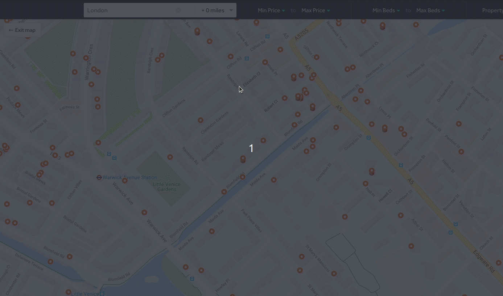

# Right Remover

[](https://travis-ci.com/tmorgansl/right-remover)
[]()

A firefox extension for hiding properties on [rightmove.co.uk](https://www.rightmove.co.uk/) you no longer want to see anymore.



Listing on the firefox add-ons store is (hopefully) coming very soon!

## Why not chrome?

Unfortunately this extension uses an API which is currently not supported in chrome or chromium-based browsers. 
Please see [MDN](https://developer.mozilla.org/en-US/docs/Mozilla/Add-ons/WebExtensions/API/webRequest/filterResponseData) and the [chromium issue tracker](https://bugs.chromium.org/p/chromium/issues/detail?id=487422) for more details.

Workarounds will happily be reviewed - if you have a suggestion please raise an issue!

## Prerequisites

* [node + npm](https://nodejs.org/) (Current Version)

## Project Structure

This project uses [webpack](https://webpack.js.org/) to build the extension.  

* src/ TypeScript source files
* public/: static files
* dist/: The output code directory
* dist/js: Generated JavaScript files

## Setup for local deployment

```
npm install
npm run watch
```

Navigate to [about:debugging](about:debugging#/runtime/this-firefox) in firefox, select 'This Firefox' and click 'Load Temporary Addon'. In the file explorer, select `dist/manifest.json` and click ok. 

The extension is hot-reloaded in real time as you make changes to the source code. 

## Build for production

```$xslt
npm install
npm run build
```


## Attributions
<div>Icons made by <a href="https://www.flaticon.com/authors/freepik" title="Freepik">Freepik</a> from <a href="https://www.flaticon.com/" title="Flaticon">www.flaticon.com</a></div>
<div>Icons made by <a href="https://www.flaticon.com/authors/kiranshastry" title="Kiranshastry">Kiranshastry</a> from <a href="https://www.flaticon.com/" title="Flaticon">www.flaticon.com</a></div>
<div>Icons made by <a href="https://www.flaticon.com/authors/bqlqn" title="bqlqn">bqlqn</a> from <a href="https://www.flaticon.com/" title="Flaticon">www.flaticon.com</a></div>
